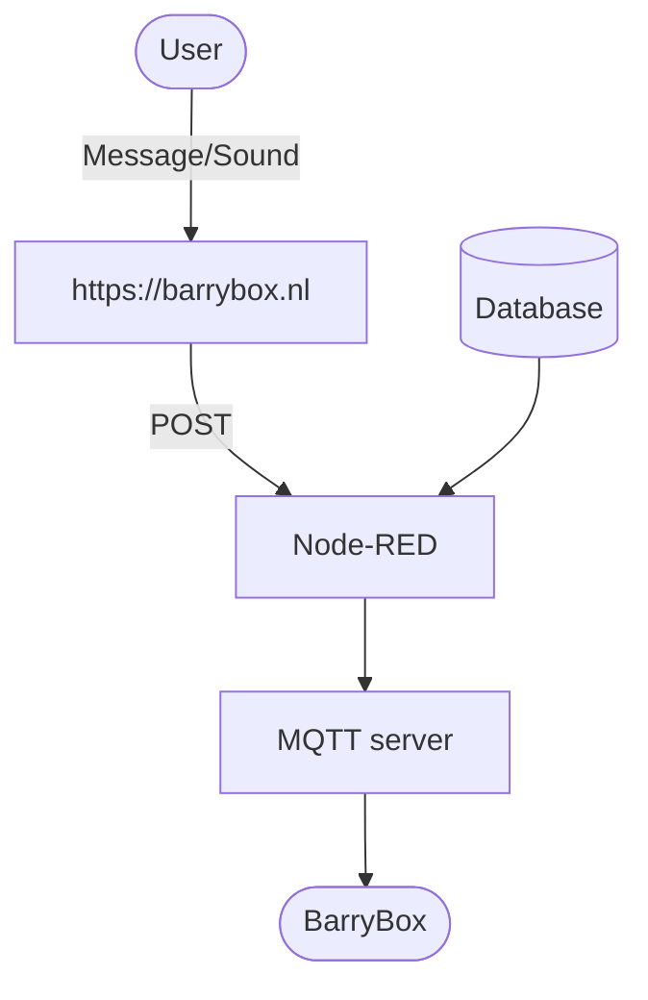


[](https://github.com/joszuijderwijk/BarryBox)


A friend of mine, a certain Barry, came up with the idea of having a speaker that could read out loud messages that you send it to. Hence the name of the speaker: BarryBox™.

The *BarryBox* is a speaker that can be directly accessed over MQTT. It uses Google Translate to generate the Text-to-Speech (TTS) audio files, and can thus be used in any language supported by Google Translate[^1]. The BarryBox can play any audio stream, which I've limited to sounds from a soundboard. The project as a whole consists of three parts: the BarryBox itself, a frontend and a backend as a bridge between the two.

The backend is designed in such a way that any BarryBox that connects to the MQTT server automatically can be reached through the frontend.

The BarryBox could also be used in a way that does not involve a (public) frontend, e.g. a TTS notifier for a smart home, a speaker that reads aloud tweets from a certain account, a WiFi radio etc. In this post I'll focus on having it read messages sent to it through a frontend.

The system is built such that it can do the following:

* Read text out loud sent to it through a website;
* Function as a soundboard;
* Queue messages / sounds;
* Support multiple BarryBoxes (each with a unique username);
* Skip through messages / sounds after a button press;
* Clear the queue after a long button press;
* Create logs.

## System overview
The BarryBox system enables users to send messages or sounds through a web interface at [barrybox.nl](https://barrybox.nl). The frontend transmits data via POST requests to a Node-RED backend, which interacts with a database and forwards communications through an MQTT server to the physical BarryBox device.



## Hardware
The device is built around an ESP32 that sends audio data to a PCM5102 Digital Analog Converter (DAC) over I2S. Strictly you do not need an external DAC because the ESP32 has one built in on GPIO25 and GPIO26 ([video example](https://www.youtube.com/watch?v=lgDu88Y411o)). But using the PCM5102 (or a similar external DAC) drastically improves the sound quality, because the inbuilt DAC only has an 8-bit resolution. I used an ESP32 because the ESP32 I2S Audio library I use is better equipped than its ESP8266 counterpart. I will elaborate on that in the Software section.

I added a small button to be able to skip audio streams. The circuit diagram is shown below.

<div style="text-align: center;">
    <object type="image/svg+xml" data="../../assets/img/barrybox-circuit.svg" class="img-fluid rounded z-depth-1" alt="BarryBox Circuit Diagram"></object>
</div>

I soldered some headers on a perfboard and connected them according to the circuit using wires. I connected the button to a terminal to be able to get the board out of its enclosure if needed.

<div style="display: flex; justify-content: center; gap: 10px;">
    
    
    
</div>
<p style="text-align: center;"><em>Construction of the BarryBox</em></p>

I drilled holes in the plastic enclosure for the button, the AUX audio output and the USB power input. I glued the button against the plastic so that it could be pressed.

<div style="display: flex; justify-content: center; gap: 10px;">
    
    
</div>
<p style="text-align: center;"><em>The BarryBox inside its plastic home</em></p>

## ESP32 software

The BarryBox makes use of the [ESP32-audioI2S library](https://github.com/schreibfaul1/ESP32-audioI2S). First, I tried to get everything working on an ESP8266, but there was [an issue](https://github.com/earlephilhower/ESP8266Audio/issues/475) managing Google TTS streams in the audio library for ESP8266.

As with most of my projects, I implemented [WiFiManager](https://github.com/tzapu/WiFiManager) that allows users to set their WiFi credentials easily. Because every BarryBox has to have a username, I added an extra parameter field. An easy way to do that is explained in their [README](https://github.com/tzapu/WiFiManager/blob/master/README.md) under *Custom Parameters*.

The BarryBox can handle three kinds of input: a TTS message, a sound from the soundboard or a link to an audio stream (this one is not available in the frontend). To differentiate between those, I implemented a class `streamable`. Currently the fields are String fields, which are known to be not optimal in terms of memory. I set the maximum size of the queue to be 20. After that, incoming messages are ignored until the queue contains less that 20 items again.

You can find the full code [here](https://github.com/joszuijderwijk/BarryBox/tree/main/ESP32/BarryBox).

## Backend
The backend consists of a database and an API. I built the API in Node-RED, but it is of course also perfectly reasonable to use an alternative (PHP, NodeJS, etc.) My Node-RED flow (import [here](https://github.com/iovidius/BarryBox/blob/main/Backend/flow.json)) looks as follows:




It features two HTTP endpoints. Both endpoints require a valid API-key in the `api-key` field of the request headers.

* POST: accepts a JSON string representing a TTS message or a sound from the soundboard. The message will be sent to the BarryBox through MQTT.

```json
{
  "client": "<THE USERNAME OF THE BOX YOU'RE SENDING TO>",
  "type": "say",
  "language": "en",
  "text": "Hello world"
}
```

```json
{
  "client": "<THE USERNAME OF THE BOX YOU'RE SENDING TO>",
  "type": "soundboard",
  "text": "<NAME OF THE SOUND>"
}
```

* GET: only requires a specified client as querystring (e.g. `https://barrybox.nl&client=jos`). Returns the current state (online or offline) and the alias.

The database is used for the following things:

* Keeping logs of the message sent using the POST endpoint;
* Keeping track of all usernames (BarryBoxes). If a BarryBox connects to the MQTT server for the first time, Node-RED will add the username to the database table;
* Storing API keys. People with an API key are authorized to use the backend.
* The database has the following tables:
    * API-keys (value, description)
    * BarryBoxClients (client, status, alias)
    * BarryBoxLogs (id, client, type, data, lang, timestamp)

## Frontend

The frontend is written in PHP, HTML/CSS and JS (JQuery). All the files in the subfolder *soundboard* are loaded. Using AJAX the information badges (e.g. online / offline) are updated automatically. The controls are disabled for three seconds aftering sending a message to prevent people from spamming.

You can find the full code of the frontend [here](https://github.com/joszuijderwijk/BarryBox/tree/main/Frontend).

{% include figure.liquid loading="lazy" path="assets/img/barrybox_frontend.png" width="50%" class="img-fluid rounded z-depth-1" alt="BarryBox Frontend" zoomable="true" %}

## Demo

The BarryBox plays its startup sound and receives a few messages.

<div class="row mt-3">
    <div class="col-sm mt-3 mt-md-0">
        {% include video.liquid width="50%" path="https://www.youtube.com/embed/L5berj419ZM" %}
    </div>
</div>

---
[^1]: For an overview of supported languages, see: [https://developers.google.com/workspace/admin/directory/v1/languages](https://developers.google.com/workspace/admin/directory/v1/languages)