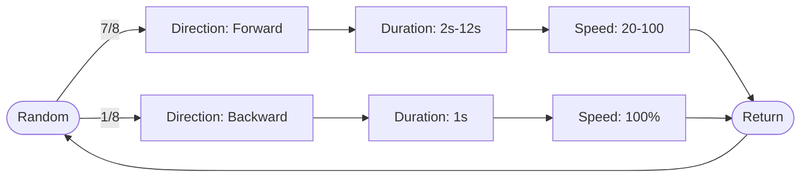


[](https://github.com/joszuijderwijk/StefStuntpiloot)


Stef Stuntpiloot (or [Loopin' Louie](https://en.wikipedia.org/wiki/Loopin%27_Louie)) is a fun game and (at least in the Netherlands) also popular among students. I got a copy of this boardgame as a birthday present. Stef runs on 2AA batteries (+3V), which is not terribly fast. I thought it might be fun to give him a little boost. In this blogpost I'll give a description of what I did.

It might be useful to know that there already is a [blogpost](https://www.instructables.com/HACKED-Looping-Louie-on-steroids/) by GreatScott (whose [YouTube-channel](https://www.youtube.com/channel/UC6mIxFTvXkWQVEHPsEdflzQ) is definitely worth checking out!) in which modding this game is described. My approach is similar, with a few differences: (1) I use different hardware parts, (2) my random mode works differently, (3) I added the ability to change settings, (4) I added a 'bets' functionality, which basically shows the amount of sips/shots that the one who loses all three coins has to drink.

## Hardware
The game is built on a DC simple motor that runs on +3V. I found that the game also runs fine up until around 9V; after adding more juice things start to get shaky.

I used the following parts:
* Arduino Nano;
* L293D motor driver IC;
* IC socket;
* 9V 1A DC power supply;
* DC jack;
* 470 µF capacitor;
* 220 µF capacitor;
* L7805CV voltage regulator;
* 20k potentiometer;
* 3x tactile buttons with plastic caps;
* Plastic case;
* LCD1602 (blue) + I2C Module;
* Perf board;
* Shrink tube;
* Wires.

The circuit diagram is displayed below.

<div style="text-align: center;">
    <object type="image/svg+xml" data="../../assets/img/stef-circuit.svg" class="img-fluid rounded z-depth-1" alt="Looping Louie Circuit Diagram"></object>
</div>

Once assembled, it looks like this:
<div style="display: flex; justify-content: center; gap: 10px;">
    
</div>
<p style="text-align: center;"><em>Controls: (1) 9VDC input, (2) speed knob, (3) NEXT, (4) BACK, (5) SELECT, (6) output</em></p>


It was really hard to get all the electronics inside the small case. Using just the ATMEGA IC would save space compared to an Arduino Nano. Unfortunately, I had no oscillators lying around, so with the help of duct tape I got everything in anyway.

<div style="display: flex; justify-content: center; gap: 10px;">
    
    
    
    
</div>
<p style="text-align: center;"><em>The assembly process</em></p>

## Software
The full code is [publicly available](https://github.com/joszuijderwijk/StefStuntpiloot). In this section I'll highlight some of the features, specifically, those that you want to change if you are building your own version.


### LCD Menu
One of the core features is the interactive menu. The device consists of three buttons, in order: NEXT, BACK and SELECT. There is also an additional potentiometer to control the speed. You can see the main menu in the images below. Using the NEXT button, the user can navigate through the menu. The following images were created using the [VrEmuLcd emulator](https://github.com/visrealm/VrEmuLcd) (and some Photoshop).

<div style="display: flex; justify-content: center; gap: 10px;">
    
    
</div>
<p style="text-align: center;"><em>Overview of the main menu</em></p>
In the top right corner, you'll see a ⏸️ or a ▶️ character, which indicates whether Stef is currently active or not. These custom characters can easily be made as LCD character using the [LCD Custom Character Generator](https://maxpromer.github.io/LCD-Character-Creator/).

If the user selects (SELECT) the *Default* option, Stef will run at his original speed (~33%). The *Speed* option allows the user to change Stef's speed using the potentiometer. The speed is displayed at all times in the main menu. The *Random* option starts the random sequence (see *Random* section).

The *Settings* menu opens a new submenu (see *Settings* section). To go back to the main menu, the BACK button is used. The menu's are encoded as follows:

```c
// MENU SETTINGS
int menuPos = 0;
char *Menu[] = {"Default", "Speed", "Random", "Settings"};
char *Settings[] = {"Show bets", "Level"};
enum menu { main, settings, bet, info};
menu currentMenu = main;
```

Note that there is also an *Info* menu, which appears after pressing the MID button 5 times in a row. Since there are only two rows on the screen, the ">" character has only two places to go. Going to the next menu item is therefore simple, i.e., `menuPos = (menuPos + 1) % n`. Note that `n` depends on which menu is active. The main menu is displayed using the same logic:

```c
// First menu item
lcd.setCursor(1, 0);
lcd.print(Menu[2 * (menuPos / 2)]);

// Second menu item
lcd.setCursor(1,1);
lcd.print(Menu[2 * (menuPos / 2) + 1]);
```

Depending on the value of `currentMenu` the behaviour of the buttons can be determined. The speed and the play/pause icon are always present in the same location, and are refreshed upon change.

### Random
The random sequence is depicted in the following diagram:


All values, including the direction probability, in this diagram are set using constants. The speed and duration (forward) is chosen uniformly.

### Settings
The user can set two settings. *Show bets* is a boolean. If true, at the end of a sequence (start → stop), an amount of sips, shots (or in my implementation: 'Rutgershots', which is a very specific way of drinking a shot) will be displayed. The loser of that round (i.e., the person with no coins left) would have to drink those. The other setting is *Level*. There are three levels: easy, medium and hard. These influence the minimum and maximum number of the amount of drinks, as well as the type of drinks.
{% include figure.liquid width="50%" zoomable="true" path="assets/img/stef-submenu.png"%}
The types of drinks, the intervals and probabilities are encoded here:

```c
// bets
char *Bets[] = {"sips", "shot", "rutgershot"};
int EasyIntervals[] = {2, 8, 1, 1, 1, 1};   // min/max amount of sips, shots, rutgershots
int EasyProb[] = {8, 1, 1}; // probability distribution
int MedIntervals[] = {5, 10, 1,1, 1,1};
int MedProb[] = {5, 3, 2};
int HardIntervals[] = {5, 15, 1, 2, 1, 1};
int HardProb[] = {7, 1, 2};
```
If more types of drinks or difficulties were involved, using classes would be a neater solution. The intervals for each type of drink (listed in `*Bets[]` ) are hardcoded, as wel as the probabilities. For example, in easy mode, the probability of a sip is 8/10, and for everything else 1/10. In easy mode, at most 1 shot (or Rutgershot) can be displayed.

Both settings are saved into EEPROM.

## Demonstration

<div class="row mt-3">
    <div class="col-sm mt-3 mt-md-0">
        {% include video.liquid width="50%" path="https://www.youtube.com/embed/5MCIS7cAwmU" %}
    </div>
</div>